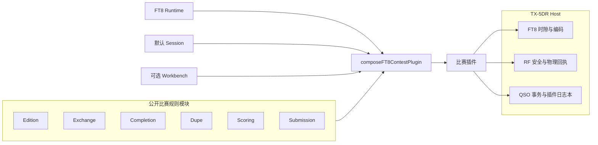
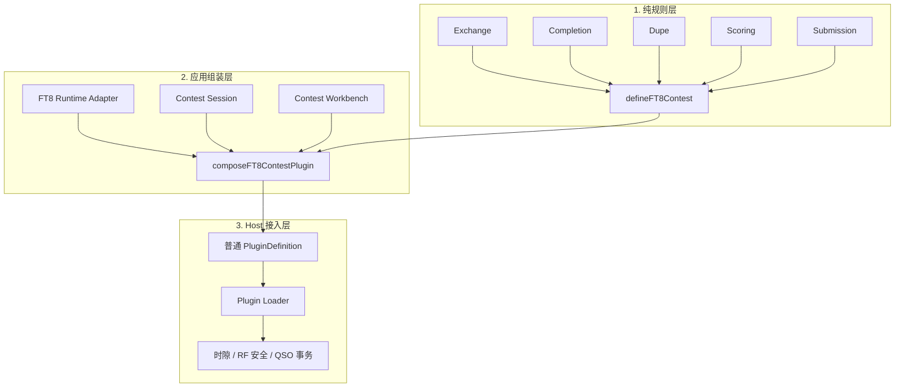
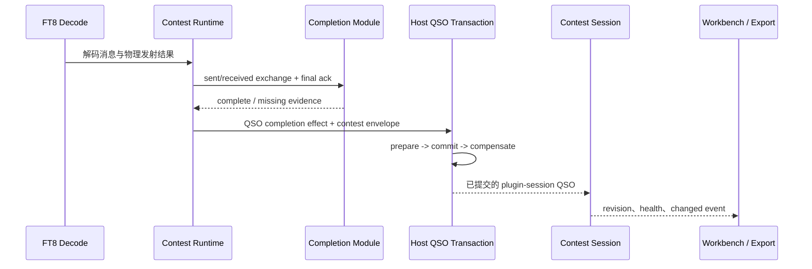

# FT8 比赛插件

Contest SDK 用“公开规则模块 + 默认组装器”表达 FT8 / FT4 比赛。插件作者保留比赛规则和 runtime 的控制权；Host 继续负责时隙、编码、RF 安全、物理发射确认、日志事务和隔离存储。

本轮只覆盖 FT8 / FT4。不要从这些接口推导 CW、多模式比赛或年度系列排名。

## 先从脚手架开始

```bash
npx create-tx5dr-plugin my-ft8-contest --template ft8-contest
cd my-ft8-contest
npm install
npm run build
npm test
```

脚手架会生成比赛 definition、runtime 骨架、locale、测试和可独立部署的 bundle。先让它通过测试，再替换示例规则；不需要从零搭建 session、导入导出或测试工具。

## 架构边界



判断归属的方法很简单：规则换一场比赛就可能改变的内容放在插件模块；与比赛名称无关的时序、安全、事务和资源隔离留在 Host。

## 组装式 API 的三层结构

组装不是把所有能力塞进一个 factory。它分两次组合，最后仍然得到普通 `PluginDefinition`：



三层之间只有明确接口：

- `defineFT8Contest()` 只冻结规则模块，不注册插件、不打开日志本，也不接触电台。
- runtime adapter 消费 contest definition，把解码和通联进度转换为规则模块所需的输入。
- session/workbench 是可替换的应用模块，负责状态与页面协议，但不解释比赛计分规则。
- `composeFT8ContestPlugin()` 只连接这些模块并映射必要的 Host capability 声明；返回值仍可像任何 strategy 插件一样检查和测试。
- Host 不知道 `WW Digi`、`FT Challenge` 等比赛名称，只执行通用生命周期、安全和事务机制。

因此，新增比赛通常只替换规则 definition 和 runtime adapter。session、workbench、导入审核事务、兼容检查与测试工具可以直接复用。某一场比赛需要特殊页面或并行 runtime 时，只替换那个端口；不需要 fork 整套比赛框架。

依赖方向必须保持单向：runtime 可以调用纯规则模块，页面可以读取 session 投影；纯规则模块不能反向访问 `ctx`、页面或 Host capability。这个限制让规则可以脱离 Host 做 golden test，也避免以后通过隐藏约定继续打补丁。

| 模块 | 负责什么 | 常用实现 |
| --- | --- | --- |
| edition | 一届比赛的身份、时间窗和规则来源 | `fixedWeekendEdition()` |
| exchange | 解析、格式化和校验交换 | `gridExchange()`、`gridAndSnrExchange()` |
| completion | 何时具备完整 QSO 证据 | `requireExchangeAndFinalAck()` |
| dupe | 归一化和重复通联 key | `oncePerBand()` |
| scoring | 单 QSO 分、倍率和聚合 | `distancePoints()`、`gridFieldMultiplier()` |
| submission | 生成提交文件 | `cabrilloSubmission()` |
| session | 独立日志、revision retry、通知和健康状态 | `defaultContestSession()` |
| workbench | 设置、分数、日志、审核和导入导出的窄页面协议 | `defaultContestWorkbench()` |
| runtime | 把纯规则连接到 FT8 通联状态机 | 脚手架 runtime 或自定义 `FT8RuntimeModule` |

## 定义一场比赛

下面的例子使用 Grid、每波段判重、3000 km 距离步进和每波段 Grid Field 倍率：

```ts
import {
  cabrilloSubmission,
  defineFT8Contest,
  distancePoints,
  fixedWeekendEdition,
  gridExchange,
  gridFieldMultiplier,
  oncePerBand,
  requireExchangeAndFinalAck,
  type FT8ContestQso,
  type GridExchange,
} from '@tx5dr/plugin-api/contest';

interface ContestQso extends FT8ContestQso<GridExchange> {
  frequencyKhz: number;
  cabrilloDateTime: string;
}

export const contest = defineFT8Contest<GridExchange, ContestQso>({
  id: 'example-ft8',
  rulesetVersion: '2026.1',
  edition: fixedWeekendEdition({
    id: '2026',
    startAt: '2026-08-29T00:00:00Z',
    endAt: '2026-08-30T00:00:00Z',
    source: {
      url: 'https://example.org/contest/2026-rules',
      confirmedAt: '2026-08-01T00:00:00Z',
    },
  }),
  modes: ['FT8'],
  bands: ['40M', '20M', '15M', '10M'],
  exchange: gridExchange(),
  completion: requireExchangeAndFinalAck({ finalAck: 'either' }),
  dupe: oncePerBand(),
  scoring: distancePoints<ContestQso>({
    stepKm: 3000,
    multiplierKeys: gridFieldMultiplier({
      grid: (qso) => qso.receivedExchange?.grid,
      band: (qso) => qso.band,
    }),
  }),
  submission: cabrilloSubmission<ContestQso>({
    headers: () => [['CONTEST', 'EXAMPLE-FT8']],
    qsoLine: (qso) =>
      `QSO: ${qso.frequencyKhz} DG ${qso.cabrilloDateTime} ${qso.callsign}`,
  }),
});
```

`contestId + editionId + rulesetVersion` 是持久化身份。赛历变化时创建新 edition；规则语义变化时提升 `rulesetVersion`。不要从当前日期或可变网页内容重新解释旧 QSO。

## 组装插件

```ts
import {
  composeFT8ContestPlugin,
  CONTEST_SESSION_PERMISSIONS,
  defaultContestSession,
} from '@tx5dr/plugin-api/contest';
import { createRuntime } from './runtime.js';
import { contest } from './contest.js';

const session = defaultContestSession({
  create: () => ({
    schemaVersion: 1,
    revision: 0,
    settings: {},
  }),
});

export default composeFT8ContestPlugin({
  name: 'example-ft8',
  version: '0.1.0',
  minPluginApiVersion: '2.1.0',
  permissions: CONTEST_SESSION_PERMISSIONS,
  contest,
  session,
  runtime: createRuntime,
});
```

`createRuntime` 是比赛协议与 `StrategyRuntime` 的连接点。普通单流比赛保留默认安全值：人工发起、一个 QSO stream、一个同时发射信号。只有规则允许并且 runtime 真正实现并行接口时，才提高并发声明。

`composeFT8ContestPlugin()` 是便利入口，不是唯一入口。需要特殊生命周期时，可以直接使用同一批公开模块和 `definePlugin()` 手动连接；不要继承一个庞大的比赛基类。

## 一次 QSO 如何落盘



比赛交换保存在 QSO 的有界 `contestEntry` envelope 中；设置、页面筛选和投影缓存才放在 session state。导入、审核和 transmitter 修改使用 session 的 QSO transaction facade，使 QSO 与比赛事实一起提交。不要再维护一份新的 sidecar 账本，也不要自行拼 session key 或事件 topic。

## 替换一个规则模块

构造器表达不了规则时，实现对应的小接口，不需要修改 Host。例如州/省或流水号交换可以替换 exchange；特殊重复规则只替换 dupe：

```ts
import { defineDupeModule } from '@tx5dr/plugin-api/contest';

const oncePerBandAndMode = defineDupeModule<ContestQso>({
  id: 'callsign-band-mode',
  scope: 'mode',
  key: (qso) => [qso.callsign, qso.band, qso.mode]
    .map((value) => value.trim().toUpperCase())
    .join(':'),
});
```

保持模块纯净：相同输入必须得到相同输出。存储、网络、页面和电台操作不应进入 exchange、dupe 或 scoring。

## 测试真实规则

```ts
import { createFT8ContestTestKit } from '@tx5dr/plugin-api/contest';

const kit = createFT8ContestTestKit(contest);

kit.exchange({ grid: 'FN31' }, { grid: 'FN31' });
kit.invalidExchange({ grid: 'ZZ99' }, 'invalid_grid');
kit.completion({
  sentExchange: { grid: 'PL04' },
  receivedExchange: { grid: 'FN31' },
  receivedFinalAck: true,
}, true);
```

建议把官方规则中的距离、倍率、特殊交换、重复通联和提交行固定成 golden vector。测试名称应描述规则事实，例如“5541 km 计 2 分”，而不是只写“scoring works”。

除了纯规则测试，还要覆盖：

- runtime 的 `checkpoint()` / `restore()`、取消和 supersede
- 缺少交换或物理确认时不完成 QSO
- session revision conflict 重试和通知失败
- ADIF / Cabrillo round trip
- 生成后的独立 bundle 能在没有项目 workspace 的环境加载

## 什么时候使用 advanced API

普通比赛不要直接使用 `ParallelQSOCoordinator`。只有官方规则允许多 stream 或同帧多信号，并且测试覆盖 lane 恢复、物理确认和并发上限时，才替换 `FT8RuntimeModule`。

同样，先不要为年度系列排名增加 `SeriesModule`。等第二个真实系列赛出现并证明有重复，再提取系列聚合能力。

## 发布与兼容

- Contest SDK 从 `@tx5dr/plugin-api/contest` 导入，最低 Plugin API 为 `2.1.0`。
- 插件兼容性看 `minPluginApiVersion`，不看 Host 的 `1.0.0` 或 nightly 日期。
- Marketplace artifact 中的名称、版本、最低 Plugin API、权限和 strategy feature 必须与 runtime definition 一致。
- 更新比赛规则时同时更新 edition/ruleset、规则来源、测试向量和 locale。

完整字段签名以 [Plugin API Reference](./reference/) 和 `@tx5dr/plugin-api` 包为准。
