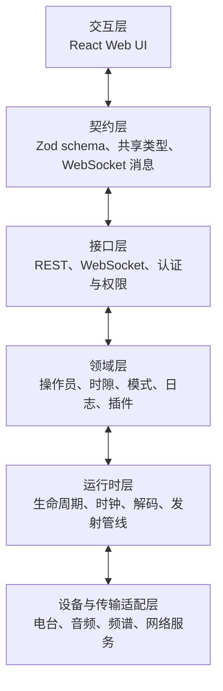
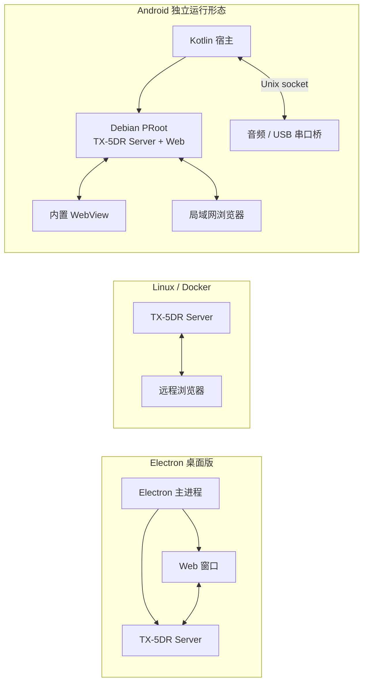

# 总体架构

TX-5DR 的主体是一个前后端分离的 Web 应用。React 前端不直接访问硬件；Fastify 服务端持有电台、音频、时钟、日志本和插件运行时。Zod schema 与 TypeScript 类型定义两端共用的消息边界。

## 分层结构

层次不代表每个事件都必须经过同样的函数调用链。它表达的是所有权：界面不拥有物理设备，适配器不决定通联策略，插件不绕过 Host 直接发射。

## 桌面、服务器与 Android

三种形态共用 Server、Web 和数据契约。Electron 提供桌面宿主与自动更新；Linux/Docker 把运行时交给服务管理器或容器；Android 则运行完整的 Linux/Node 内核，由 Kotlin 层提供移动系统才能访问的资源。

## 工作区模块

| 模块 | 责任 |
| --- | --- |
| `packages/contracts` | schema、共享类型、REST 载荷和 WebSocket 消息 |
| `packages/core` | 运行时无关的时钟、消息解析、WebSocket 客户端和通用逻辑 |
| `packages/server` | Fastify 服务、数字电台引擎、设备适配、日志与插件 Host |
| `packages/web` | React 界面、状态投影、频谱和操作面板 |
| `packages/electron-main` | 桌面进程、本地服务端启动、窗口与打包 |
| `packages/electron-preload` | Electron 沙箱与有限的桌面桥接 |
| `packages/plugin-api` | 插件作者可依赖的公共类型和工具 |
| `packages/builtin-plugins` | 与主程序发布的策略与工具插件 |
| `packages/rigctld-server` | 将通用电台控制器暴露为 NET rigctl TCP 服务 |
| `packages/client-tools` | 生产和 Android 形态中的 Web 静态入口与 API 反向代理 |

## 共享契约

`packages/contracts` 不只是 TypeScript 类型集合。Zod schema 在运行时校验来自界面、配置和插件的载荷，并为 REST 与 WebSocket 两侧提供一致类型。新增跨进程字段时，契约、服务端产生者和前端消费者必须作为一个变更单元验证。

## 系统约束

- 运行形态可以替换宿主，不改变 Server 业务所有权。
- 电台协议差异留在连接适配器中。
- 服务端事件先进入领域投影，再发往 WebSocket 或插件 Host。
- 高频数据需要订阅和背压策略，不默认广播给所有客户端。
- 与 RF 相关的关键操作必须经过权限、状态和串行化边界。
