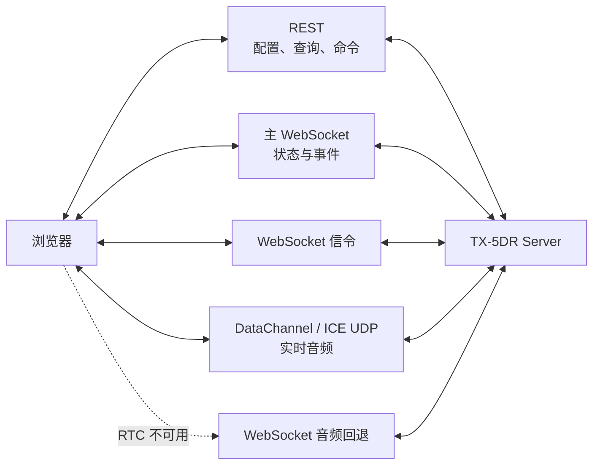
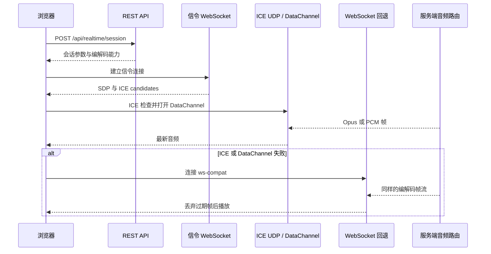

# 通信与协议

TX-5DR 同时传输可确认的配置命令、持续变化的状态和对时延敏感的音频帧。这三类数据使用不同传输，避免一条可靠队列同时承担配置持久化和过期实时帧。

## 传输分工

| 传输 | 主要责任 | 典型入口 | 语义 |
| --- | --- | --- | --- |
| HTTPS / REST | 配置、查询、文件、一次性命令 | `/api/profiles`、`/api/radio`、`/api/logbooks` | 请求/响应，有明确成功或失败 |
| WebSocket | 引擎状态、时隙、解码、电台能力、插件事件 | `/api/ws` | 长连接、双向命令与增量事件 |
| 专用 WebSocket | 日志本通知、设备 UI、实时音频回退 | `/api/ws/logbook`、`/api/device-ui/ws`、`/api/realtime/ws-compat` | 将高频或独立生命周期从主连接分离 |
| WebRTC DataChannel | 远程监听和语音上行 | WebSocket 信令 `/api/realtime/rtc-data-audio` | 无序、不可靠，优先传递最新音频 |
| ICE UDP | DataChannel 媒体 | 默认 UDP `50110` | 低延迟，可经 NAT/FRP 映射 |
| rigctld TCP | 向 WSJT-X、JTDX、N1MM、fldigi 提供标准电台控制 | 默认 TCP `4532` | Hamlib NET rigctl 文本协议 |

## REST

REST 路由主要处理需要完整结果的操作，例如保存 Profile、切换频率、导入 ADIF、创建操作员或取得实时音频会话。输入在路由边界经 schema 校验，写操作还需通过角色和能力授权。

`/api/*` 是官方 Web 界面的应用协议，并非已版本化的通用公共 API。第三方长期集成应优先使用插件 API、rigctld 或已发布的独立库。

## 主 WebSocket

客户端建立 `/api/ws` 后先完成身份与应用层握手，然后声明当前关注的操作员和高频数据订阅。服务端根据角色、Token 授权和操作员范围过滤快照与增量事件。

主要消息类型包括：

- 引擎、电台、PTT、频率和时钟状态。
- 时隙开始、解码子窗口、SlotPack 更新和发射记录。
- 操作员、策略运行时、目标队列和插件数据。
- 电台能力列表、单项能力变化、数值表与频谱帧。
- 连接被替换、认证过期、权限拒绝和重连进度。

频谱和图像接收属于高频载荷。客户端必须显式订阅，服务端监视发送缓冲区；慢客户端不应迫使服务端无限累积过期帧。

## 实时音频建链

## 电台侧协议

| 协议 | 底层传输 | TX-5DR 中的作用 |
| --- | --- | --- |
| Hamlib | 串口、TCP rigctld 或 Hamlib 后端 | 广泛的 CAT、PTT、数值表和控件适配 |
| ICOM WLAN | ICOM 私有 UDP，内含鉴权、CI-V、音频与频谱 | 无线电台控制与双向音频 |
| TCI | WebSocket 文本控制和二进制音频/IQ | SunSDR / ExpertSDR 直接控制、频谱和数值表 |
| OpenWebRX | WebSocket | 辅助接收音频、频谱和远程 SDR Profile |
| rigctld 桥接 | TCP | 把 TX-5DR 已连接的电台重新暴露给其他 HAM 软件 |

## 安全边界

REST 和 WebSocket 共用身份、角色与能力授权。服务端在执行命令时重新检查权限，不依赖前端隐藏按钮。

rigctld 协议本身没有鉴权机制。对外监听 `0.0.0.0:4532` 等价于把电台控制权交给可访问该 TCP 端口的主机，因而只应使用可信网络或额外网络隔离。
