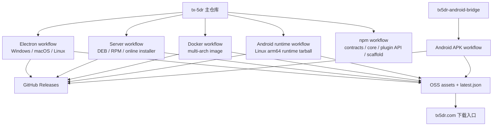
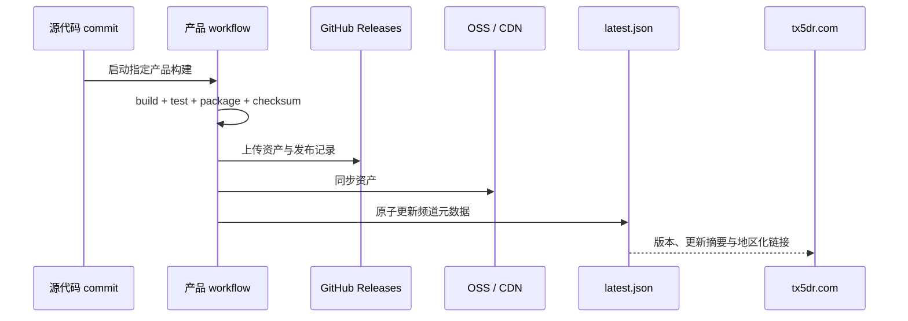

# 发布与分发链路

TX-5DR 的运行形态共用主仓库代码，但使用独立的构建和发布链路。桌面产物、Linux 服务器包、Docker 镜像、Android 运行时、Android APK 和 npm 公共包不代表同一个发布单元。

## 产物关系

## 主仓库 workflow

| Workflow | 产物 | 需要验证的差异 |
| --- | --- | --- |
| `electron-release.yml` | NSIS、DMG、DEB、RPM、AppImage 与压缩包 | Electron ABI、签名、自动更新元数据、原生模块打包 |
| `server-release.yml` | Linux amd64/arm64 DEB、RPM、在线安装器 | systemd/nginx 宿主、数据目录、服务器原生依赖 |
| `docker-release.yml` | 多架构 Docker 镜像与镜像元数据 | 容器设备映射、持久化卷、镜像 digest |
| `android-runtime-release.yml` | Android arm64 可移植 Server/Web 运行时 | PRoot 内路径、Android 宿主库、audio/serial socket 后端 |
| `npm-publish.yml` | 公共 TypeScript 包 | 包内文件、子路径导出、发布顺序、Trusted Publishing |

Android APK 来自独立的 `tx5dr-android-bridge` 仓库。APK 包含 Kotlin 宿主、WebView、PRoot 基础环境和 Android 设备桥，完整 TX-5DR Server/Web 运行时则由 Android runtime manifest 独立下载和更新。

## nightly 与 release

nightly 由指定提交生成，版本中包含时间和短 commit，可用于持续验证新功能。release 由显式版本输入生成正式 tag 与非 prerelease 附件。两者共用构建逻辑，但频道、tag、对象存储路径和 `latest.json` 不相互覆盖。

一个通道的发布元数据至少绑定：

- 产品与频道。
- 版本、commit 和构建时间。
- 每个资产的平台、架构、包类型、尺寸和校验值。
- GitHub 全球地址与 OSS/CDN 地址。
- 容器镜像的 tag 和 digest，或 Android runtime 的完整性信息。

## 元数据与官网

构建 workflow 把二进制附件上传到 GitHub Releases，并把资产与 `latest.json` 同步到 OSS。官网从 OSS 元数据取得版本和资产列表，再根据平台、CPU 架构和访问地区选择推荐资产与下载地址。因此，“GitHub Release 有附件”不等于“官网已看到新版本”。

## npm 包发布

`contracts`、`core`、`plugin-api` 和 `create-tx5dr-plugin` 存在依赖顺序。新版本不能在上游包尚未被 npm registry 稳定查询时继续发布下游包。workflow 使用 npm Trusted Publishing，仍需对每个真实 tarball 执行 `npm pack --dry-run` 和消费者 smoke test。

## 发布门槛

| 门槛 | 可证明 | 不能证明 |
| --- | --- | --- |
| 源码 lint / test / build | 当前 runner 上的代码与类型边界通过 | 所有平台原生模块可加载 |
| 打包 smoke test | 发布物包含必需文件并可启动 | 真实电台协议已验证 |
| GitHub Release 成功 | 全球资产已上传 | OSS 元数据和 CDN 已更新 |
| OSS `latest.json` 可读 | 官网有可消费的元数据 | 每个资产的签名、校验和启动都正常 |
| 官网显示新版本 | 展示链路已更新 | 用户设备上的安装、升级和回滚行为正常 |
