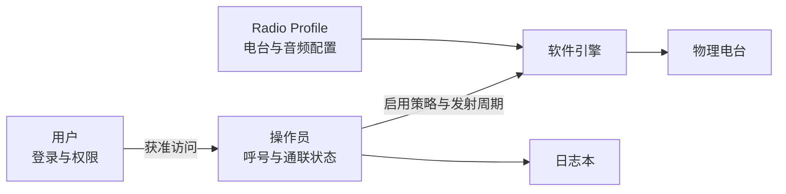

# 领域模型

TX-5DR 同时处理物理设备、运行时资源、人员身份和通联业务。这些概念在界面中经常同时出现，但拥有不同的生命周期。

## 概念与所有权

| 概念 | 含义 | 主要所有者 |
| --- | --- | --- |
| 物理电台 | 真实的收发信机，具有物理电源、VFO、PTT 和可选控件 | 电台适配器 |
| 电台连接 | 一次 Hamlib、ICOM WLAN 或 TCI 会话 | 物理电台管理器 |
| Radio Profile | 电台连接、音频设备、模式偏好和运行参数的持久化组合 | Profile 管理器 |
| 软件引擎 | 解码、时钟、电台、音频和自动化资源的运行集合 | 引擎生命周期 |
| 用户 | 登录 TX-5DR 的身份，携带角色、Token 和权限 | 认证与授权系统 |
| 操作员 | 一个业余电台身份，包含呼号、网格、发射周期、音频偏移和策略状态 | 操作员管理器 |
| 模式 | FT8、FT4、语音、CW、SSTV 或 FAX 的时钟与处理规则 | 模式注册与引擎 |
| 时隙 | 数字模式的一个有界时间单元 | 服务端时钟 |
| SlotPack | 属于同一时隙的解码帧、本机发射回显和统计快照 | 时隙数据管理器 |
| 日志本 | QSO 记录、ADIF 导入导出、健康状态和同步关系 | 日志本服务 |
| 插件 | 被 Host 调用的策略或工具扩展 | 插件 Host |

## Profile、用户与操作员

Profile 不代表呼号，操作员也不代表登录用户。同一个 Profile 可以为多个获准操作员提供同一部电台；一个用户只能访问 Token 授予的操作员。服务端在发射时统一仲裁操作员状态、时隙和电台状态。

## 三条独立状态轴

| 状态轴 | 典型值 | 不等价于 |
| --- | --- | --- |
| 软件引擎 | `idle / starting / running / stopping` | 电台物理开机 |
| 电台连接 | `disconnected / connecting / connected / reconnecting` | 软件引擎已运行 |
| 物理电源 | `off / on / standby / operate / unknown` | 断开 CAT 连接 |

例如，服务端可以已启动但电台仍在重连；也可以用 `control-only` 会话唤醒电台，再根据显式策略启动完整引擎。任何一条状态轴都不应被偷偷映射成另一条状态轴的命令。

## RF 频率与音频偏移

电台频率是 VFO 工作的 RF 频率，例如 `14.074 MHz`。操作员的 `frequency` 是通带内的音频偏移，例如 `1000 Hz`。多操作员可以共用同一 RF 频率，但使用不同音频偏移组合发射帧。

## 能力与控件

连接建立后，电台适配器生成当前能力快照。能力条目包含标识、数据类型、可读写性、取值范围和当前值。Web 界面根据这些元数据生成开关、选项、滑杆和数值表，而不把特定电台型号固化在界面中。
