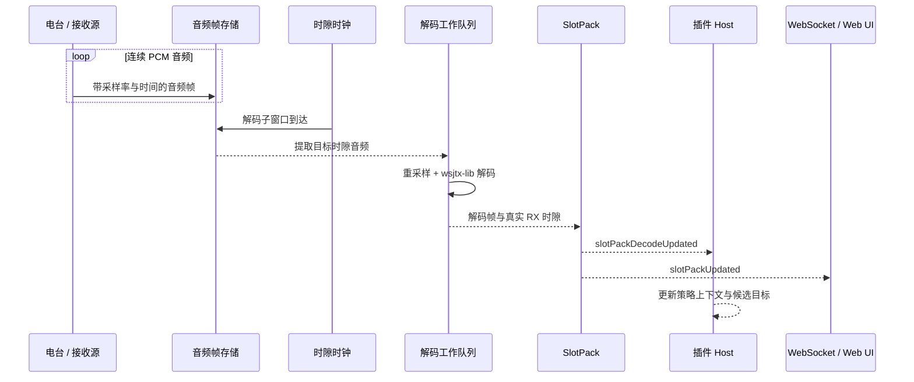
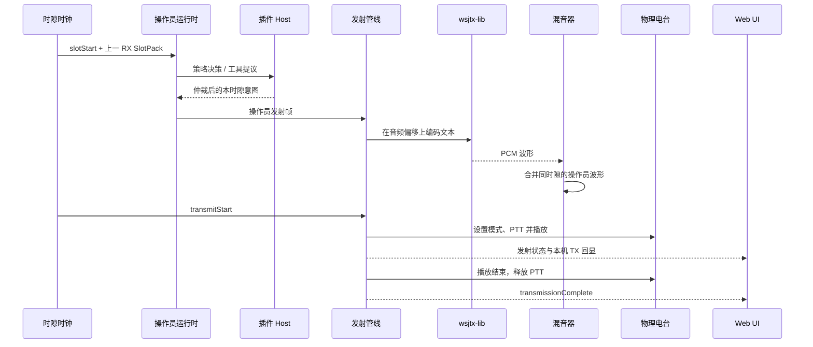

# FT8 收发时序

FT8 的正确行为依赖服务端时钟，而不依赖浏览器定时器。每个时隙为 `15 s`，信号在边界后约 `0.5 s` 开始，有效波形持续约 `12.64 s`。

## 接收与解码

默认 balanced 配置在一个 FT8 时隙内进行三次解码，约位于 `T+11.8 s`、`T+13.5 s` 和 `T+14.7 s`。较早窗口降低响应延迟，末尾窗口利用更完整的信号。同一解码帧可能在多个 pass 中出现，SlotPack 负责去重和持有时隙身份。

## 决策与发射

浏览器点击呼叫、策略自动响应和工具插件的自动起呼最终都进入同一个 Host 仲裁边界。插件不产生未受控的 PTT 命令；发射管线在当前时隙、操作员周期和电台连接有效后才接受发射帧。

## 事件语义

| 事件 | 含义 |
| --- | --- |
| `slotStart` | 新时隙边界，携带时隙信息与可用的上一时隙快照 |
| `subWindow` | 某次解码 pass 到达 |
| `slotPackDecodeUpdated` | 真实 RX 解码已更新，可供策略和上报使用 |
| `slotPackUpdated` | 用于界面和状态投影的完整时隙快照，可包含 TX 回显 |
| `encodeStart` | 当前模式的预编码时机 |
| `transmitStart` | 进入可执行发射的时点 |
| `transmissionComplete` | 音频播放和 PTT 收尾完成 |

## 关键不变式

- 解码结果保留原始 RX 时隙，不使用回调执行时的当前时隙替代。
- 过期时隙的解码结果不能回流到新的策略决策。
- 局部解码只能支持严格识别发件人后的显式人工操作，自动化与 RF 决策保持 fail-closed。
- 多操作员波形在 PTT 之前统一混音，底层电台只看到一次发射事务。
- PTT 释放和发射完成不依赖浏览器仍然在线。

## 代码定位

- 时隙调度：`packages/core/src/clock/SlotClock.ts`
- 时钟事件桥：`packages/server/src/subsystems/ClockCoordinator.ts`
- 解码工作队列：`packages/server/src/decode/`
- 时隙快照：`packages/server/src/slot/SlotPackManager.ts`
- 发射管线：`packages/server/src/subsystems/TransmissionPipeline.ts`
- 操作员运行时：`packages/server/src/operator/`
