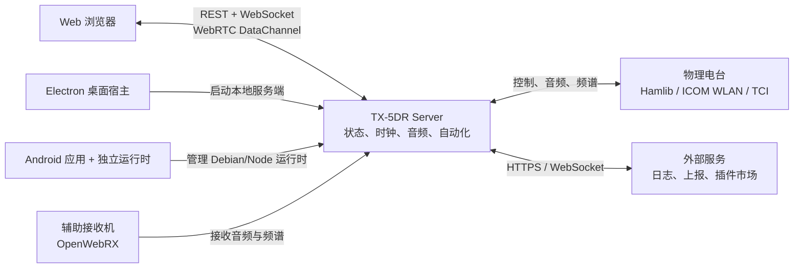

# TX-5DR Wiki

TX-5DR 把电台控制、音频处理、数字模式、操作员状态和浏览器界面放在同一个服务端运行时中。桌面窗口、远程浏览器和 Android 设备最终使用相同的 Web 界面与数据协议。

安装、配置电台和完成通联的操作见 [使用指南](../guide/)。插件的类型、Hook 和完整签名见 [插件 API](../plugin-api/)。

## 系统全景

服务端是物理资源和业务状态的唯一所有者。浏览器展示状态并发送受权命令，不直接占用串口、声卡或电台会话。因此，关闭浏览器不会自动中断服务端运行的解码、连接恢复和自动化任务。

## 核心知识

| 主题 | 内容 |
| --- | --- |
| [设计目标与边界](./why-tx5dr) | 远程操作、硬件抽象、实时传输和 RF 安全约束 |
| [领域模型](./domain-model) | Profile、操作员、用户、引擎、时隙和日志本的关系 |
| [总体架构](./architecture) | Web、Server、Electron、Android 与共享契约 |
| [通信与协议](./communications) | REST、WebSocket、WebRTC/UDP、rigctld 以及电台侧协议 |
| [状态与生命周期](./lifecycle) | 启动、电台 bootstrap、优先级和断线恢复 |
| [FT8 收发时序](./ft8-flow) | 时隙、解码窗口、策略决策、编码和 PTT |
| [实时语音与远程音频](./realtime-audio) | 音频源选择、Opus/PCM、UDP 媒体和回退 |
| [电台适配层](./radio-adapters) | Hamlib、ICOM WLAN、TCI、OpenWebRX 和动态能力 |
| [插件与事件系统](./plugin-system) | 策略、工具、Host 仲裁和调用边界 |
| [公共 Node.js / Rust 库](./packages) | 可独立复用的电台协议、数字模式和 DSP 库 |
| [贡献者代码地图](./contributing) | 修改各类功能时的所有权边界和代码位置 |

## 对外接口边界

TX-5DR 当前承诺的对外扩展面是 `@tx5dr/plugin-api`、标准 rigctld 兼容端口和独立发布的公共库。`/api/*` REST 路由和主 WebSocket 协议首先服务于官方 Web 客户端，目前没有独立的版本号和第三方兼容承诺。
