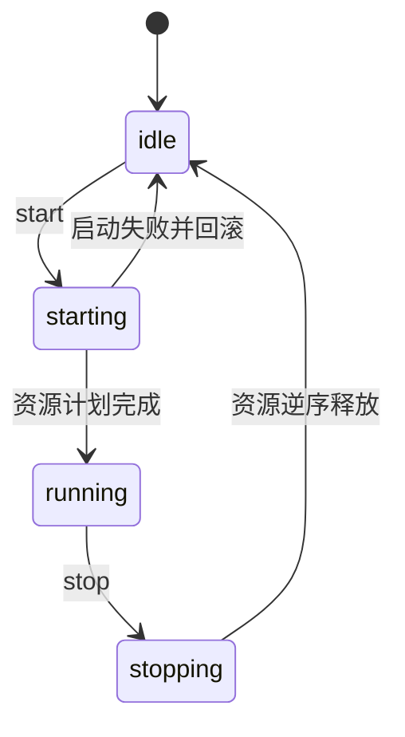
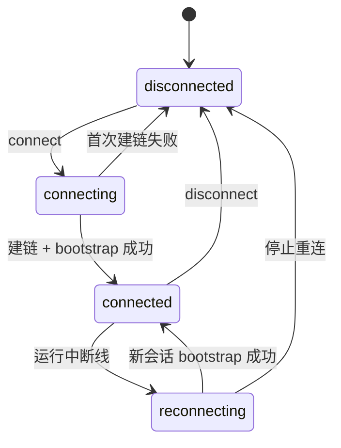
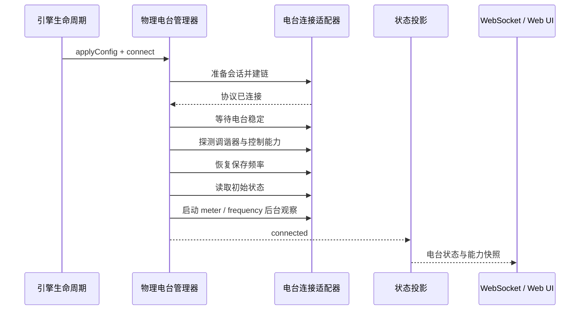

# 状态与生命周期

软件引擎、电台连接和电台物理电源是三条独立状态轴。这种拆分允许服务端在电台断线时保留界面、配置与诊断能力，也防止一个含糊的 `power` 命令同时改变软件和物理电台。

## 引擎状态

引擎启动不是单一函数打开所有资源。生命周期层根据当前模式生成资源计划，按顺序启动电台、音频、时钟、解码和模式服务。任一必需资源失败时，已启动的资源按相反顺序回滚。

## 电台连接状态

连接对象只负责协议建链和最小初始化。能力探测、保存频率恢复与后台轮询由上层连接会话统一编排。

## 连接后初始化

`connected` 只在一次性 bootstrap 完成后发出。如果在初始频率读取之前就启动 meter 轮询，老式串口电台会同时收到多组命令，还可能把过渡状态投影给界面。

## 电台 I/O 优先级

| 类型 | 例子 | 策略 |
| --- | --- | --- |
| 关键写操作 | PTT、切频、切模式、电源事务 | 严格串行，不被观察流打断 |
| 复合工作状态 | 频率 + 模式 + 数据模式 | 作为一个复合操作提交 |
| 能力与数值观察 | S 表、SWR、ALC、当前频率 | 低优先级，关键操作期间可跳过 |
| 健康检查 | 心跳、连接指标 | 失败先记录，不单凭一次 meter 失败判定断线 |

## 断线与恢复

运行中断线会使旧会话的后台任务失效，并进入带退避的重连流程。新连接必须重新完成 bootstrap，不复用旧会话的能力快照或定时器。断线发生在发射期间时，操作员和界面还会收到专用的发射中断事件。

## 代码定位

- 资源启停：`packages/server/src/subsystems/EngineLifecycle.ts`
- 连接会话与 bootstrap：`packages/server/src/radio/PhysicalRadioManager.ts`
- 物理电源事务：`packages/server/src/radio/RadioPowerController.ts`
- 电台事件投影：`packages/server/src/subsystems/RadioBridge.ts`
- 底层连接契约：`packages/server/src/radio/connections/IRadioConnection.ts`
