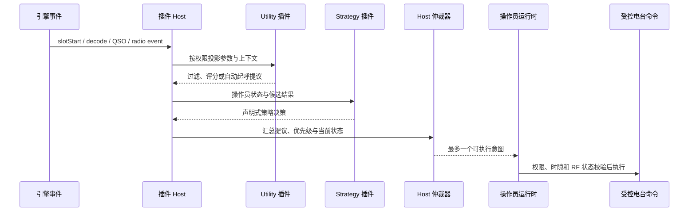

# 插件与事件系统

插件层承载可替换的通联策略、候选筛选、自动起呼、日志同步和自定义面板。核心引擎保留时钟、电台、PTT、权限和最终仲裁，插件通过 Host 提供的有限上下文参与系统。

## 插件类型

| 类型 | 并存规则 | 典型责任 |
| --- | --- | --- |
| Strategy | 每个操作员同时选择一个 | QSO 状态、待发文本、时隙决策和操作员动作 |
| Utility | 多个叠加启用 | 过滤、评分、守候、定时任务、日志同步和面板数据 |

Strategy 是当前操作员的通联状态机，Utility 则在共享事件上提供附加能力。Utility 不因能够看到解码事件就自动获得 RF 控制权。

## 事件与决策流

自动起呼 Utility 返回 proposal，而不在解码回调中直接提交呼叫。Host 收集所有活跃插件的提议，按优先级、命中消息顺序和稳定插件标识仲裁，每个决策周期最多产生一次统一呼叫请求。

## 公共 API 边界

外部插件只应依赖 `@tx5dr/plugin-api`。该包提供：

- `definePlugin()` 和插件定义。
- 由权限列表推导的上下文与结构化命令端口。
- StrategyRuntime、Hook、EventBus、KV 存储和日志同步类型。
- `testing` 测试工厂、`contest` 竞赛组合模块和 iframe Bridge 类型。

`packages/server/src/plugin/` 中的类、内部事件实例和引擎对象不属于公共插件 API。插件依赖这些内部实现会绕过权限投影，并在主程序重构时失去兼容性。

## 能力与调用生命周期

插件必须在 `permissions` 中声明所需能力。Host 只把获准属性投影到该插件的上下文，未声明属性在 TypeScript 类型和运行时对象中都不存在。

Host 能力句柄只在当前回调有效。回调结束、超时、重载或卸载后，持有旧上下文并异步调用 Host 会被拒绝。配置、KV、查询结果和事件载荷跨边界时以值传递，插件修改本地副本不会隐式改变 Host 状态。

## 自定义 UI

插件页面在 iframe 中运行，通过 Bridge SDK 调用已注册动作、读取主题 token 和接收面板数据。iframe 不直接获取服务端内存对象或底层设备句柄。自定义 UI 的网络请求、宿主调用和权限错误保留独立诊断边界。

## 安全范围

能力模型防止普通插件在无声明情况下使用敏感 Host 能力，但当前 Node.js 插件仍在服务端进程中执行。这不是针对恶意代码的操作系统级沙箱。管理员应把安装第三方插件视为运行受信任的服务端代码。

## 代码定位

- 公共插件类型：`packages/plugin-api/`
- 插件加载、生命周期与 Host：`packages/server/src/plugin/`
- 内置插件：`packages/builtin-plugins/src/`
- 插件脚手架：`packages/create-tx5dr-plugin/`
- 完整接口和教程：[插件 API](../plugin-api/)
