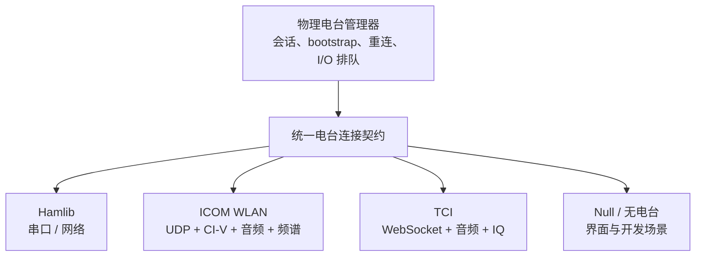
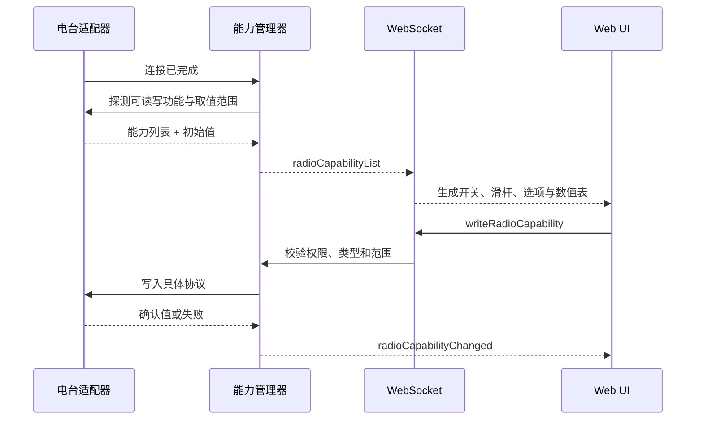

# 电台适配层

电台兼容性不只是“能读频率”。TX-5DR 把连接、PTT、模式、双向音频、频谱、数值表和设备参数统一到电台连接契约，再根据每个实例真正具备的能力动态展示界面。

## 连接实现

| 连接 | 控制 | 音频 | 频谱 | 数值表与参数 |
| --- | --- | --- | --- | --- |
| Hamlib 串口 | CAT、PTT、VFO、Split、电源等 | 通常使用独立声卡 | 部分电台可用 Hamlib spectrum | 由 Hamlib 能力和机型 profile 提供 |
| Hamlib 网络 | 经 rigctld 或网络后端控制 | 通常独立 | 取决于后端 | 取决于后端命令集 |
| ICOM WLAN | 直接鉴权、CI-V、PTT、调谐器 | 12 kHz LPCM 收发 | CI-V `0x27` scope | S 表、SWR、ALC、功率、NR、NB、Split 等 |
| TCI | VFO、模式、PTT、驱动功率等 | TCI 二进制音频流 | TCI IQ 流 + Rust FFT | 会话协商后的 meter 和控制能力 |

## 通用连接契约

适配器至少需要对上层提供连接状态、频率、模式和 PTT。其他能力按实际支持情况可选暴露：

- 收发音频帧与采样率。
- 频谱帧、显示模式和中心/固定边界。
- 功率、S 表、SWR、ALC、电压、电流等 meter。
- AF、RF、静噪、降噪、噪声抑制、前置放大、衰减、天线和调谐器等控件。
- Split TX 频率、RIT/XIT、中继差频、亚音等特定工作能力。

上层通过 `applyOperatingState` 之类的复合入口提交频率与模式意图，避免在连接实现外拆成可被其他轮询穿插的多次写操作。

## 动态能力投影

写操作不使用前端显示值作为成功证据。底层协议确认后，服务端再广播实际值；不支持、超出范围或电台拒绝都保留原状态。

## OpenWebRX 的位置

OpenWebRX 是接收源，不实现完整的发射电台契约。TX-5DR 可以使用其远程音频和频谱执行解码与预览，同时保留 Hamlib、ICOM WLAN 或 TCI 连接负责发射。这种拆分允许接收站与发射站位于不同网络和地理位置。

## 对外 rigctld 桥接

TX-5DR 还可以反向扮演一个 Hamlib rigctld 服务器。WSJT-X、JTDX、N1MM Logger+ 或 fldigi 通过 NET rigctl 连入后，请求被转成统一电台控制器命令，最终仍走同一条电台 I/O 排队。这使 ICOM WLAN 或 TCI 连接的电台也能以标准 rigctld 方式供其他软件使用。

## 代码定位

- 连接契约与实现：`packages/server/src/radio/connections/`
- 会话、bootstrap 与重连：`packages/server/src/radio/PhysicalRadioManager.ts`
- 能力定义与探测：`packages/server/src/radio/capabilities/`
- 频谱源选择：`packages/server/src/spectrum/`
- OpenWebRX 集成：`packages/server/src/openwebrx/`
- rigctld 桥接：`packages/server/src/rigctld/`
