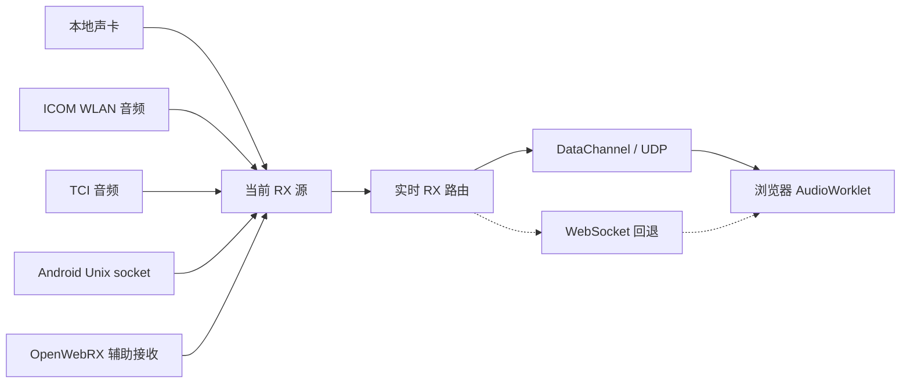
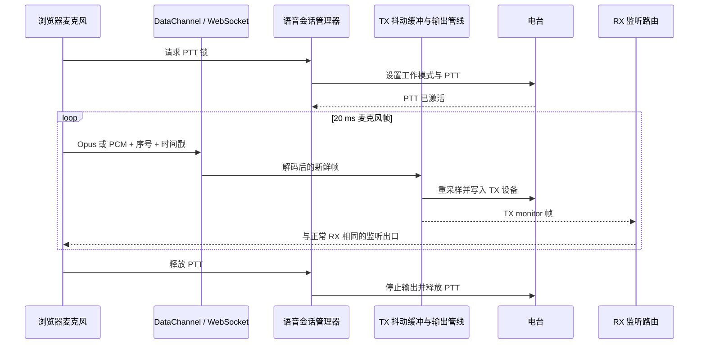

# 实时语音与远程音频

实时音频不是文件传输。一帧音频如果已经过期，重传它只会增加监听和 PTT 延迟。TX-5DR 因此把最新帧、有界队列和延迟可观测性放在完整性重传之前。

## 接收音频所有权

电台监听运行时中，服务端只选择一个权威 RX 源。网络电台可以自带音频，普通 Hamlib 电台通常使用独立声卡，Android 运行形态则通过 Unix socket 把 AudioRecord/AudioTrack 桥接到 Linux 服务端。OpenWebRX 可作为辅助接收源，但不替代发射电台的控制会话。

## 传输与编解码

| 层 | 行为 |
| --- | --- |
| 主传输 | 无序、不可靠 WebRTC DataChannel，媒体通常走 ICE UDP |
| 回退传输 | WebSocket `ws-compat`，保持与主传输相同的帧元数据和过期丢弃策略 |
| 默认编码 | 服务端与浏览器都支持时优先 Opus |
| 编码回退 | Opus 在当前传输上失败时改用 PCM，不必立即切换网络传输 |
| 帧长 | Opus 使用 `20 ms` 帧，在带宽和交互延迟之间取平衡 |
| 重采样 | 仅在源、编解码器和设备采样率不同的真实边界执行 |

48 kHz 声卡音频可以直接以 48 kHz Opus 编码。ICOM WLAN 通常提供 12 kHz 音频；浏览器支持相应 Opus 采样率时保留原生采样率，否则使用流式重采样器转换到可协商采样率。PCM 回退可对 48/96 kHz 源做保持相位的整数抽取，避免网络传输不必要的高码率。

## 语音 PTT 上行

浏览器麦克风发出 16 kHz 单声道、`20 ms` 帧。服务端在电台 PTT 真正激活前不开始大量播放，仅保留小型启动缓冲。抖动或网络堵塞造成的旧帧被丢弃，而不是在 PTT 已经结束时延迟播放。

## 延迟策略

- 队列以毫秒预算限制，不以无限包数限制。
- 发送端和接收端都可根据序号、时间戳和缓冲深度丢弃旧帧。
- 短暂丢帧只使用有界 PLC 或静音，不在欠载后重建大型预缓冲。
- 传输回退时保留浏览器 AudioContext 和 AudioWorklet，只替换网络通道。
- 端到端时延只在浏览器/服务端时钟同步可靠时记录；否则单独记录服务端内部处理时延。

## NAT 与公网 UDP

服务端在 SDP 中保留本地 ICE candidate。配置 FRP 或静态 NAT 映射时，公网主机和 UDP 端口作为额外 candidate 追加，不替换局域网 candidate。公网映射错误时，局域网仍可直连，外部浏览器仍可回退到 `ws-compat`。

## 代码定位

- RX 源选择：`packages/server/src/realtime/RealtimeRxAudioSource.ts`
- RX 路由：`packages/server/src/realtime/RealtimeRxAudioRouter.ts`
- DataChannel 会话：`packages/server/src/realtime/RtcDataAudioManager.ts`
- 编解码管线：`packages/server/src/realtime/RealtimeAudioCodecPipeline.ts`
- 语音会话：`packages/server/src/voice/`
- 浏览器传输：`packages/web/src/services/realtime/`
